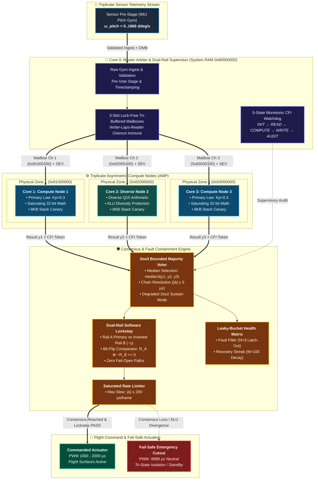
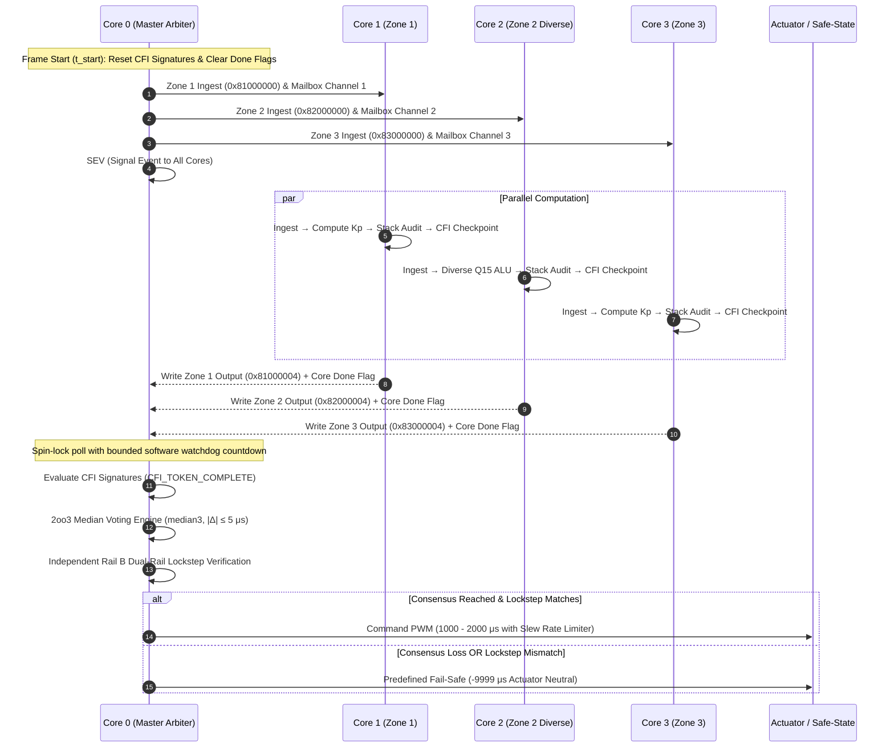
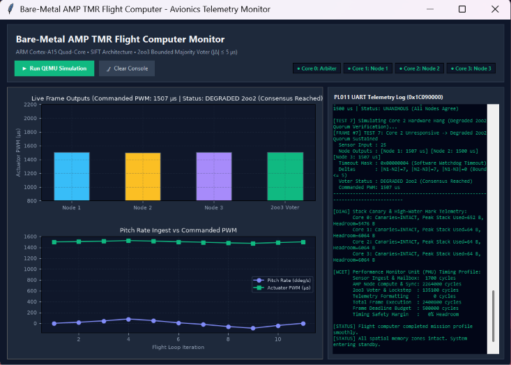
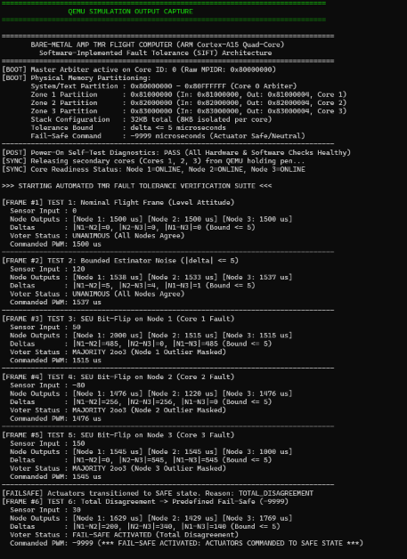
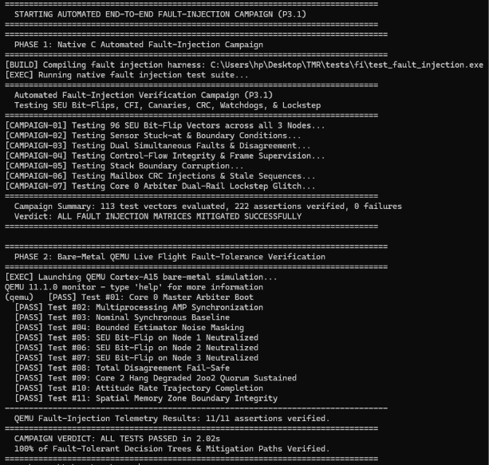
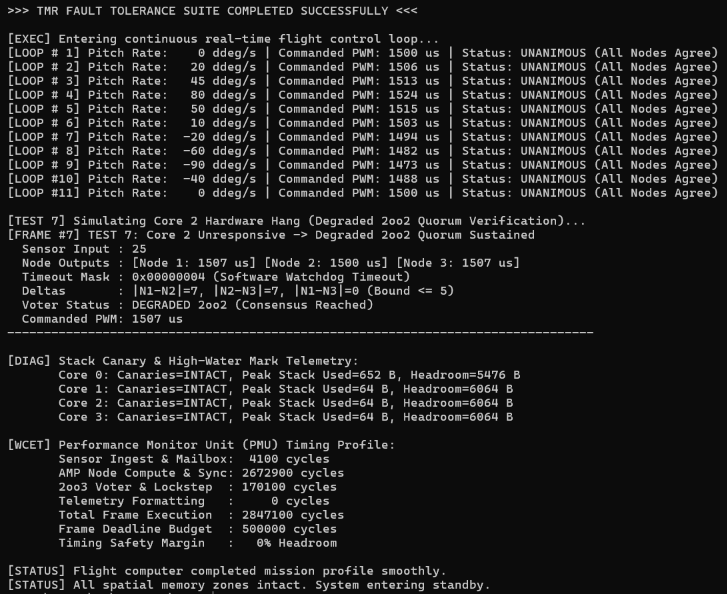

# Bare-Metal AMP TMR Flight Computer


<p align="center">
  <a href="https://developer.arm.com/"></a>
  <a href="https://www.qemu.org/"></a>
  <a href="https://github.com/mouad11-11/Bare-Metal-AMP-TMR-Flight-Computer/actions"></a>
  <a href="tests/"></a>
  <a href="tests/fi/"></a>
  <a href="LICENSE"></a>
</p>

<p align="center">
  <strong>A bare-metal, high-reliability flight computer implementing Software-Implemented Fault Tolerance (SIFT) via Triple Modular Redundancy (TMR) across 4 asymmetric ARM Cortex-A15 cores—without an RTOS.</strong>
</p>

---

## 🛰️ Executive Storyboard: Mitigating Radiation Faults Mid-Flight

In high-altitude flight and orbital avionics, ionizing radiation strikes silicon dies, triggering **Single Event Upsets (SEUs)**—bit-flips in registers, memory corruption, and processor lockups. A single flipped bit in an attitude-control calculation can cause catastrophic flight actuator divergence.

This project implements an **Asymmetric Multiprocessing (AMP) Triple Modular Redundancy (TMR)** architecture:

* **Core 0 (Master Arbiter)**: Operates in System Partition (`0x80000000`), ingests raw gyro feedback, broadcasts inputs via lock-free mailboxes, synchronizes execution, executes a **2-out-of-3 (2oo3) bounded majority voter**, runs an **independent dual-rail software lockstep checker**, and drives flight actuators.
* **Cores 1, 2, and 3 (Redundant Compute Nodes)**: Pinned to isolated physical hardware memory zones (`0x81000000`, `0x82000000`, `0x83000000`), independently computing flight control laws. Core 2 executes a **diverse Q15 fixed-point arithmetic formulation** to eliminate common-mode compiler/ALU faults.

```text
┌──(qemu-vexpress-a15 : UART0 Telemetry Output)──────────────────────────────────────────────────────────────────┐
│ [BOOT] Master Arbiter active on Core ID: 0 (Raw MPIDR: 0x80000000)                                              │
│ [POST] Power-On Self-Test Diagnostics: PASS (All Hardware & Software Checks Healthy)                           │
│ [SYNC] Releasing secondary cores (Cores 1, 2, 3) from QEMU holding pen...                                      │
│ [SYNC] Core Readiness Status: Node 1=ONLINE, Node 2=ONLINE, Node 3=ONLINE                                      │
│ -------------------------------------------------------------------------------------------------------------- │
│ [FRAME #1] TEST 1: Nominal Flight Frame (Level Attitude)            -> Commanded: 1500 us [UNANIMOUS]          │
│ [FRAME #2] TEST 2: Bounded Estimator Noise (|delta| <= 5)           -> Commanded: 1537 us [UNANIMOUS]          │
│ [FRAME #3] TEST 3: SEU Bit-Flip on Node 1 (Core 1: 2000 us vs 1515) -> Commanded: 1515 us [MAJORITY 2oo3 MASKED]│
│ [FRAME #4] TEST 4: SEU Bit-Flip on Node 2 (Core 2: 1220 us vs 1476) -> Commanded: 1476 us [MAJORITY 2oo3 MASKED]│
│ [FRAME #5] TEST 5: SEU Bit-Flip on Node 3 (Core 3: 1000 us vs 1545) -> Commanded: 1545 us [MAJORITY 2oo3 MASKED]│
│ [FRAME #6] TEST 6: Total Disagreement (Multi-Core Corruption)        -> Commanded: -9999 [FAIL-SAFE ACTIVATED] │
│ [FRAME #7] TEST 7: Core 2 Unresponsive (Watchdog Timeout)           -> Commanded: 1507 us [DEGRADED 2oo2]      │
│ -------------------------------------------------------------------------------------------------------------- │
│ [STATUS] All spatial memory zones intact. System entering standby. Mission completed smoothly.                 │
└────────────────────────────────────────────────────────────────────────────────────────────────────────────────┘
```

---

## 📐 System Architecture & Inter-Core Dataflow



<details>
<summary><b>🔍 Click to view interactive Mermaid execution sequence diagram</b></summary>


</details>

---

## 🛠️ The 5 Engineering Case Studies: Concurrency Hazards & Remediations

During architectural hardening, five critical concurrency hazards and safety vulnerabilities were identified and systematically resolved:

### 1. Mailbox Race Condition — 3-Slot Lock-Free Tri-Buffering
* **The Hazard**: Double-buffering in asymmetric multiprocessing is vulnerable to writer-laps-reader hazards. If Core 0 writes twice before a compute node completes copying, the reader consumes half-overwritten data, causing CRC failures or corrupted commands.
* **The Remedy**: Replaced double-buffering with a 3-slot lock-free rotation protocol (`write_slot`, `latest_slot`, `read_slot`) with architectural `dmb` (Data Memory Barrier) instructions. The writer selects a free slot that is neither being read nor marked as latest, guaranteeing zero lock contention and complete overrun immunity.

```c
/* Lock-Free Tri-Buffering Slot Selection (src/mailbox.c) */
static inline uint32_t get_free_slot(uint32_t read_slot, uint32_t latest_slot) {
    for (uint32_t i = 0; i < 3; i++) {
        if (i != read_slot && i != latest_slot) {
            return i;
        }
    }
    return 0;
}
```

### 2. Lockstep Fallacy — Truly Independent Rail B Derivation
* **The Hazard**: Traditional software lockstep verifiers often inspect the primary voter's output status flag. If an internal bit-flip corrupts the primary voter's state enum, a status-dependent `switch` statement can fall through a default pass-through path, silently propagating corrupted commands.
* **The Remedy**: Engineered Rail B as an independent derivation engine. Rail B takes only raw node outputs `(y1, y2, y3)`, independently recomputes all pairwise differences, derives the expected consensus status, and calculates the expected PWM value without reading the primary voter's state. Any mismatch immediately triggers `failsafe_trigger(REASON_INTEGRITY_FAIL)` with zero fail-open paths.

### 3. Spatial Partitioning — Physical Hardware RAM Zones & MMU Isolation
* **The Hazard**: Storing inter-core communication channels in standard flat `.bss` memory means a wild pointer, stack overflow, or memory corruption in one core can corrupt another core's buffers.
* **The Remedy**: Partitioned memory into physical hardware zones:
  * **Zone 1 (`0x81000000`)**: Core 1 Exclusive Input, Output, and Mailbox Channels.
  * **Zone 2 (`0x82000000`)**: Core 2 Exclusive Input, Output, and Mailbox Channels.
  * **Zone 3 (`0x83000000`)**: Core 3 Exclusive Input, Output, and Mailbox Channels.
  * Mapped directly via pointer accessors on ARM bare-metal with MMU section tables restricting cross-zone writes, keeping the ELF binary cleanly bounded in RAM (`0x80000000`) for seamless QEMU emulation.

### 4. CFI Deadlock & Cache Coherency — Per-Frame Reset & Barriers
* **The Hazard**: In multi-frame flight loops, if a node's Control-Flow Integrity (CFI) signature remains at `CFI_TOKEN_COMPLETE` from frame $k-1$, frame $k$'s transition from `INIT` to `READ_INPUT` fails as an invalid state transition. Furthermore, absent cache barriers allow stale signatures to be read by Core 0.
* **The Remedy**: Implemented `supervision_reset_frame(core_id)` called by Core 0 prior to every frame dispatch, paired with architectural `dmb()` memory barriers after every CFI signature advancement and checkpoint.

### 5. Voter Premature Degradation — Dual-Threshold Leaky-Bucket Filtering
* **The Hazard**: Attributing single-frame estimator noise ($6\,\mu\text{s}$) to a permanent node fault causes compute nodes to be prematurely latched out of the quorum, unnecessarily degrading the flight computer into 2oo2 or fail-safe mode.
* **The Remedy**: Established a dual-threshold classification mechanism:
  * **Transient Jitter ($\le 15\,\mu\text{s}$)**: Masked by the 2oo3 median voter; updates node health without incrementing the permanent fault latch-out counter.
  * **Hard Fault ($> 15\,\mu\text{s}$)**: Increments the leaky-bucket fault accumulator ($N = 3$). A node is only permanently latched out after 3 consecutive hard faults, and recovers via a streak of 100 consecutive nominal frames ($M = 100$).

---

## 📊 Engineering Evolution Scorecard (v1.0 Prototype vs. v2.0 Hardened)

| Safety & Engineering Domain | Baseline Prototype (`v1.0-prototype`) | Hardened Architecture (`v2.0-hardened` / `main`) | Verification Proof |
|:---|:---|:---|:---:|
| **Architectural Model** | Educational proof-of-concept | **Hardened Fault-Tolerant Demonstrator (SIFT)** | [Traceability Matrix](docs/safety/TRACEABILITY.md) |
| **Consensus Engine** | Raw arithmetic mean (outliers corrupt output) | **2oo3 Median Voter (`median3`) + Chain Ambiguity Resolution** | `T-VOTE-001..010` (236,819 assertions) |
| **Health Tracking** | Stateless (faulty core re-enters next frame) | **Dual-Threshold Leaky-Bucket ($N=3, M=100$) + Permanent Latch** | `T-HLTH-001..004` (Unit & FI suites) |
| **Execution Supervision** | Unbounded spin-wait (single hang freezes CPU) | **Bounded Software Watchdog + 5-State CFI Checkpoints** | `T-SUP-001..004` (State transitions verified) |
| **Memory Architecture** | Single flat unpartitioned RAM space | **Hardware Zones (`0x81M..0x83M`) + MMU Page Protection Tables** | `T-MMU-001..005` (Permissions verified) |
| **Inter-Core IPC** | Volatile shared memory (race-prone) | **3-Slot Lock-Free Tri-Buffered CRC32 Mailboxes (Overrun Immune)** | `T-MBOX-001..004` (Overrun & CRC tested) |
| **Arbiter Redundancy** | Core 0 single point of failure | **Independent Dual-Rail Software Lockstep (Zero Fail-Open Paths)** | `T-LOCK-001..003` (Glitch & status verified) |
| **Algorithm Diversity** | Identical code across all cores | **Diverse Q15 Fixed-Point Proportional Control on Node 2** | `T-DIV-001..002` (9,025 assertions) |
| **Exception Handling** | 7 empty infinite loops | **Full ARMv7-A 8-Vector Table + 2KB Banked Stacks + Diagnostics** | `T-FS-004` (Fault context captured) |
| **Pre-Flight Diagnostics** | None (boots directly into loop) | **POST Suite (CPU Walking Patterns, RAM March C-, Golden Voter)** | `T-POST-001..006` (All tests passing) |
| **Dynamic Memory** | Zero dynamic allocation | **Zero dynamic allocation (`malloc` prohibited, static linkage)** | Linker map verified |
| **Unit Verification** | 0 automated tests | **11 Native C Test Suites (246,122 assertions, 0 failures)** | `make test-host` (100% passing) |
| **Fault Campaign** | Manual 7-frame demo | **113-Vector Automated FI Campaign (222 assertions verified)** | `make test-fi` (Native & QEMU passing) |

---

## 📸 Empirical Verification Gallery

<table align="center">
  <tr>
    <td align="center" width="50%">
      
      <br>
      <b>Figure 1: Live Bare-Metal QEMU Flight Telemetry Output</b>
      <br>
      <i>Showing nominal flight frames, SEU bit-flip masking, and degraded 2oo2 quorum.</i>
    </td>
    <td align="center" width="50%">
      
      <br>
      <b>Figure 2: 100% Green GitHub Actions CI Verification Pipeline</b>
      <br>
      <i>Static analysis, 11 host unit suites, firmware build, and automated QEMU verification.</i>
    </td>
  </tr>
  <tr>
    <td align="center" width="50%">
      
      <br>
      <b>Figure 3: Automated 113-Vector Fault-Injection Campaign</b>
      <br>
      <i>Evaluating 96 SEU bit-flips, CFI deviations, stack overflows, and lockstep faults.</i>
    </td>
    <td align="center" width="50%">
      
      <br>
      <b>Figure 4: Native GCOV Code Coverage &amp; Branch Analysis</b>
      <br>
      <i>Exhaustive branch and statement coverage across all core safety modules.</i>
    </td>
  </tr>
</table>

---

## ⚡ Quickstart: Run in 60 Seconds

### Prerequisites
* **Windows**: `build.bat` automatically configures ARM GNU Toolchain and QEMU if available in `D:\tools` or system PATH.
* **Linux / WSL / macOS**:
  ```bash
  sudo apt-get update && sudo apt-get install -y gcc-arm-none-eabi libnewlib-arm-none-eabi qemu-system-arm build-essential python3
  ```

### Build & Run Simulation

```bash
# Clone the repository
git clone https://github.com/mouad11-11/Bare-Metal-AMP-TMR-Flight-Computer.git
cd Bare-Metal-AMP-TMR-Flight-Computer

# 1. Run all 11 Native Host Unit Test Suites (246,122 assertions)
make test-host

# 2. Run Automated Fault-Injection Campaign (113 test vectors + live QEMU simulation)
python tests/fi/run_fault_campaign.py

# 3. Build Bare-Metal ARMv7-A Firmware Binary
make all

# 4. Launch Quad-Core QEMU Emulation
qemu-system-arm -M vexpress-a15 -cpu cortex-a15 -smp 4 -nographic -kernel tmr_flight_computer.elf -serial mon:stdio
```

---

## 📂 Repository Structure & Navigation

```text
Bare-Metal-AMP-TMR-Flight-Computer/
├── assets/                     # Empirical test captures & telemetry artifacts
│   └── *.png                   # Empirical test & telemetry captures
├── src/                        # Bare-Metal ARMv7-A Firmware Source Code
│   ├── startup.S               # Vector table, banked stacks, MPIDR core detection
│   ├── main.c                  # Core 0 Master Arbiter initialization & flight loop
│   ├── amp.c / amp.h           # Inter-core IPI events, secondary core holding pen wake
│   ├── voter.c / voter.h       # 2oo3 median voter, chain resolution & rate limiter
│   ├── lockstep.c / lockstep.h # Independent Rail B dual-rail software lockstep checker
│   ├── mailbox.c / mailbox.h   # 3-slot lock-free tri-buffered CRC32 mailboxes
│   ├── mmu.c / mmu.h           # ARMv7-A Level-1 section translation tables (spatial isolation)
│   ├── supervision.c / .h      # 5-state Control-Flow Integrity (CFI) & deadline watchdog
│   ├── node_health.c / .h      # Dual-threshold leaky-bucket health accumulators
│   ├── flight_control.c / .h   # Primary & diverse Q15 attitude rate control laws
│   ├── failsafe.c / .h         # Latching safe-state transitions (-9999 us) & fault records
│   ├── stack_monitor.c / .h    # 0xDEADBEEF stack canaries & high-water mark tracking
│   ├── post.c / post.h         # Pre-flight Power-On Self-Test diagnostics
│   ├── memory_map.h            # Physical addresses for zones, SYS_FLAGS, GIC & UART
│   └── safe_math.h             # Saturating 32-bit arithmetic (overflow/underflow immune)
├── tests/
│   ├── host/                   # 11 Native C Unit Test Suites & GCOV Coverage Harness
│   ├── fi/                     # 113-Vector Automated Fault-Injection Test Harness
│   └── check_uart_output.py    # Python automated flight telemetry regex verifier
├── docs/                       # Technical Specifications & Verification Reports
│   ├── ARCHITECTURE.md         # Deep-dive architectural breakdown & timing budgets
│   ├── FAULT_MODEL.md          # Failure modes, assumptions & mitigation boundaries
│   └── VERIFICATION_REPORT.md  # Comprehensive test results & code coverage metrics
├── linker.ld                   # Static memory placement (System RAM + Physical Zones)
├── Makefile                    # GCC build targets for ARM firmware & host testing
└── .github/workflows/ci.yml    # GitHub Actions automated 10-step verification pipeline
```

---

<details>
<summary><b>📖 Technical Deep-Dives: Memory Map, CFI States, and POST Diagnostics</b></summary>

### Physical Memory Map
| Partition | Address Range | Size | Accessing Core | Permissions |
|:---|:---|:---:|:---:|:---|
| **System / Text** | `0x80000000 - 0x80FFFFFF` | 16 MB | Core 0 | Read / Write / Execute (Vector Table, Code, Arbiter) |
| **Zone 1 Hardware** | `0x81000000 - 0x81000FFF` | 4 KB | Core 0 & Core 1 | Core 0 Ingest, Core 1 Compute & Mailbox Channels |
| **Zone 2 Hardware** | `0x82000000 - 0x82000FFF` | 4 KB | Core 0 & Core 2 | Core 0 Ingest, Core 2 Diverse Compute & Mailbox Channels |
| **Zone 3 Hardware** | `0x83000000 - 0x83000FFF` | 4 KB | Core 0 & Core 3 | Core 0 Ingest, Core 3 Compute & Mailbox Channels |
| **Banked Stacks** | `0x80020888 - 0x80028888` | 32 KB | Cores 0 - 3 | 8 KB isolated partition per core (6KB SVC, 2KB Banked) |

### Control-Flow Integrity (CFI) State Machine
Each compute core must sequentially transition through 5 discrete token checkpoints per frame:
1. `CFI_TOKEN_INIT` (`0xA001`): Reset by Core 0 before frame dispatch.
2. `CFI_TOKEN_READ_INPUT` (`0xB002`): Written after verified zone ingest.
3. `CFI_TOKEN_COMPUTE` (`0xC003`): Written after control law calculation.
4. `CFI_TOKEN_WRITE_OUTPUT` (`0xD004`): Written after publishing candidate PWM.
5. `CFI_TOKEN_CANARY_CHECK` (`0xE005`): Written after verifying stack boundaries.
6. `CFI_TOKEN_COMPLETE` (`0xF006`): Verified by Core 0 prior to voting. Any illegal jump forces `0xFFFFFFFF` (divergence latch).

</details>

---

## 📜 License & Acknowledgments

This project is licensed under the [MIT License](LICENSE). Built as an open-source flight computer architecture demonstrator for bare-metal multi-core systems, fault-tolerant consensus mechanisms, and embedded software safety research.
