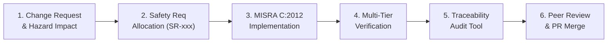

# Software Modification & Configuration Management Protocol (SMP)
## Bare-Metal AMP TMR Flight Computer System
### Applicable Standards: DO-178C Section 7 (Software Configuration Management) / DO-254 / ECSS-Q-ST-80C

---

## 1. Executive Summary & Purpose

In safety-critical avionics software (DO-178C DAL A), code cannot be modified ad-hoc. Every modification—whether a bug fix, algorithm optimization, or hardware adaptation—must follow a formal, documented, and deterministic **Software Modification Protocol (SMP)**.

This protocol establishes:
1. **The Operational Git Repository Transition Protocol**: How the repository baseline is structured, tagged, and published across versions.
2. **The 6-Phase DO-178C Change Lifecycle**: The mandatory engineering steps required before any modification can be committed or merged into the flight baseline.

---

## 2. Part A: Operational Git Repository Transition Protocol

To establish the two-version portfolio layout (`main` as hardened flagship, `v1.0-prototype` as permanent baseline archive), the following deterministic sequence is defined:

```
[Current State]
  origin/main --------> b9975e9 (v1.0 Prototype Baseline)
  origin/v2.0-hardened -> eb8ca06 (v2.0 Hardened Architecture)

[Target Transition Sequence]
  1. git branch v1.0-prototype b9975e9
  2. git tag -a v1.0.0-prototype b9975e9 -m "Release v1.0.0: Prototype Baseline"
  3. git push origin v1.0-prototype --tags
  4. git checkout main
  5. git merge --ff-only v2.0-hardened (or fast-forward to eb8ca06)
  6. git push origin main
```

### Safety Rules for Git Transitions:
1. **Zero Data Loss Invariant**: Commit `b9975e9` remains permanently pinned by the `v1.0-prototype` branch and the annotated tag `v1.0.0-prototype`.
2. **Atomic Verification Gate**: The promotion of `v2.0-hardened` into `main` requires all 11 host unit test suites (`make test-host`) and the 113-vector fault campaign (`make test-fi`) to pass with zero failures.
3. **Explicit User Authorization**: Remote pushes are executed only upon explicit user directive.

---

## 3. Part B: The 6-Phase DO-178C DAL A Modification Lifecycle

Every future modification to the flight computer must progress through the following six sequential engineering gates:



---

### Phase 1: Software Change Request (SCR) & Hazard Impact Analysis
1. **Problem Statement**: Document the defect symptom, anomalous behavior, or functional enhancement.
2. **Subsystem Identification**: Identify affected subsystems (Voter, Health Latch, Mailbox, MMU, Watchdog, PMU).
3. **Hazard Re-Assessment**:
   - Consult [`docs/safety/HAZARD_ANALYSIS.md`](safety/HAZARD_ANALYSIS.md) and [`docs/safety/FMEA.md`](safety/FMEA.md).
   - Evaluate whether the proposed change alters any fault tree cut set in [`docs/safety/FTA.md`](safety/FTA.md).
   - Confirm that no new Single Point of Failure (SPOF) is introduced into Core 0 or inter-core communication.

---

### Phase 2: Safety Requirements Allocation & Specification
1. Every code change must map to a formal numbered requirement in [`docs/safety/SAFETY_REQUIREMENTS.md`](safety/SAFETY_REQUIREMENTS.md) (`SR-001` through `SR-016` or a newly allocated `SR-017+`).
2. Requirements must be expressed using EARS (Easy Approach to Requirements Syntax):
   - *Event-driven*: `WHEN <event>, the system SHALL <response>.`
   - *State-driven*: `WHILE in <state>, the system SHALL <behavior>.`
3. Identify the target verification method:
   - Host Unit Test (`T-xxx`).
   - Automated Fault Injection Vector (`FI-xxx`).
   - Bare-Metal QEMU Telemetry Assertion (`QEMU-xxx`).

---

### Phase 3: Implementation & Defensive Coding Standards
1. **MISRA C:2012 & SEI CERT C Adherence**:
   - Zero dynamic memory allocation (`malloc`, `free`, `calloc`).
   - Zero recursion, zero variable-length arrays (VLAs), zero `setjmp`/`longjmp`.
   - Integer/fixed-point arithmetic only (no floating point in the safety path).
   - All loops bounded by provable static constants (`WATCHDOG_MAX_CYCLES`).
2. **NASA/JPL "Power of Ten" Compliance**:
   - Functions restricted to $\le 60$ lines.
   - Minimal variable scope; check all return values.
   - Saturated arithmetic helpers (`safe_math.h`) used for all additions, subtractions, and divisions.
3. **Spatial & Temporal Hygiene**:
   - Maintain single-writer discipline for all shared memory variables.
   - Explicit memory barriers (`dmb`, `dsb`, `isb`) placed around shared memory transactions.
   - Four-word stack canaries (`0xDEADBEEF`) preserved at stack bottoms.
4. **Compiler Warning Enforcement**:
   - Code must compile with `-Wall -Wextra -Werror -Wshadow -Wconversion -Wstrict-prototypes` producing **0 warnings**.

---

### Phase 4: Multi-Tier Verification Gates (Mandatory Acceptance Criteria)

Before any commit is accepted, the developer must execute the three verification tiers:

```bash
# Tier 1: Host Native Unit Tests & Coverage Analysis
make test-host
# Acceptance Criteria:
# - 11/11 test suites pass with 0 assertion failures.
# - voter.c, node_health.c, failsafe.c, supervision.c, safe_math.h achieve 100% Branch Coverage.
# - Modified Condition / Decision Coverage (MC/DC) satisfied for all multi-condition branches.

# Tier 2: Automated End-to-End Fault-Injection Campaign
make test-fi
# Acceptance Criteria:
# - 113/113 fault injection vectors pass.
# - 0 undetected erroneous outputs.
# - All 11 live flight telemetry assertions pass on QEMU Cortex-A15.

# Tier 3: Cross-Compilation Target Build
make all
# Acceptance Criteria:
# - Zero warnings under arm-none-eabi-gcc.
# - Binary size within 16MB system partition limits.
```

---

### Phase 5: Automated Traceability Verification
Run the automated verification script:
```bash
python tools/check_traceability.py
```
- **Acceptance Criteria**:
  - Script returns exit code `0`.
  - Confirms every Safety Requirement maps to a valid source file, real function name, and executed test ID.
  - Zero orphan requirements and zero orphan tests.

---

### Phase 6: Code Review, Pull Request & Baseline Promotion
1. **Branch Naming Convention**:
   - `fix/<issue-description>` for bug fixes.
   - `feat/<subsystem-name>` for new safety mechanisms.
   - `docs/<document-name>` for documentation updates.
2. **Atomic Commits**:
   - One logical change per commit with imperative commit message:
     `fix(voter): saturate delta subtraction against 32-bit overflow (BUG-01)`
3. **Pull Request Review & Merging**:
   - Open Pull Request against `main`.
   - CI pipeline must report green across all jobs (`build`, `host-tests`, `qemu-tests`, `traceability`).
   - Merge via squash or fast-forward merge to maintain linear, reviewable git history.
4. **Release Tagging**:
   - Tag major architectural releases using Semantic Versioning (`vX.Y.Z-qualifier`).
