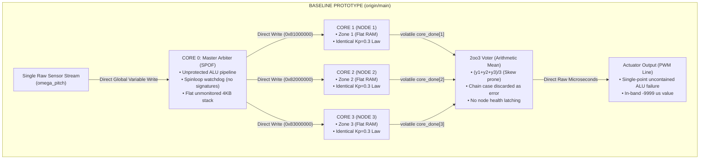
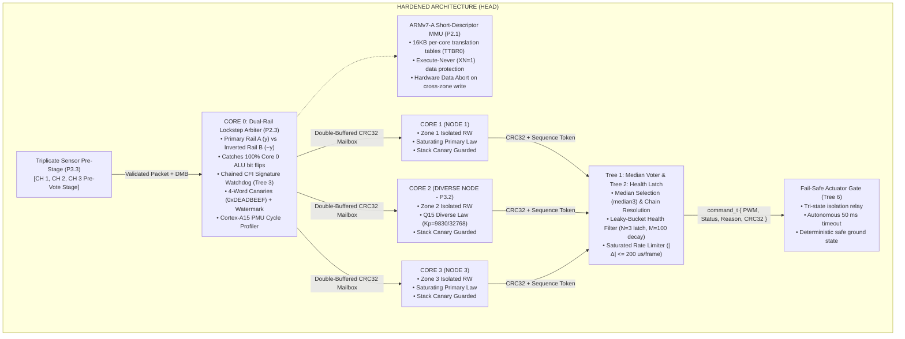

# Architectural Schematics & Block Diagrams: Side-by-Side Comparison
## Baseline Prototype (origin/main) vs. Hardened Architecture (HEAD)

---

## 1. Architectural Block Diagram Comparison (Side-by-Side)

### Baseline Prototype Architecture


### Hardened Architecture


---

## 2. Functional & Circuit Schematic Side-by-Side

```
========================================================================================================================
    BASELINE PROTOTYPE SCHEMATIC (REV 1.0)              |         HARDENED ARCHITECTURE SCHEMATIC (REV 2.0)
========================================================================================================================
                                                        |
  [ SINGLE SENSOR ] ---> OMEGA_RAW                      |   [ IMU CH1 ] ---\
        |                                               |   [ IMU CH2 ] ----+--> [ 3x SENSOR PRE-VOTER ]
        v                                               |   [ IMU CH3 ] ---/           |
  [ CORE 0 ARBITER ]                                    |                              v (Validated Sensor Packet)
  +-----------------------------------------------+     |   [ ARMv7-A MMU UNIT ] <---> [ CORE 0 DUAL-RAIL ARBITER ]
  | • Direct ALU Pipeline (SPOF: Unprotected)    |     |   +-------------------+      +-------------------------------+
  | • Volatile core_done[4] polling               |     |   | TTBR0 Per-Core    |      | [Rail A: Normal y1,y2,y3]     |
  | • Unmonitored 4KB Stack                       |     |   | XN=1 Exec-Never   |      | [Rail B: Inverted ~y1,~y2,~y3]|
  +-----------------------------------------------+     |   | Guard Pages       |      | Comparator: RailA ^ ~RailB==0 |
        |                 |                 |           |   +-------------------+      | Chained CFI Signature Tokens  |
        | Direct Write    | Direct Write    | Direct    |                              | 8KB Canaries [0xDEADBEEF]     |
        | (0x81000000)    | (0x82000004)    | (0x83M)   |                              +-------------------------------+
        v                 v                 v           |            |                 |                 |
  [ CORE 1 NODE ]   [ CORE 2 NODE ]   [ CORE 3 NODE ]   |      Double-Buffered    Double-Buffered    Double-Buffered
  +-------------+   +-------------+   +-------------+   |      CRC32 Mailbox      CRC32 Mailbox      CRC32 Mailbox
  | Zone 1 Flat |   | Zone 2 Flat |   | Zone 3 Flat |   |            |                 |                 |
  | Kp=0.3 Law  |   | Kp=0.3 Law  |   | Kp=0.3 Law  |   |            v                 v                 v
  +-------------+   +-------------+   +-------------+   |   [ CORE 1 NODE ]   [ CORE 2 NODE ]   [ CORE 3 NODE ]
        |                 |                 |           |   +---------------+ +---------------+ +---------------+
        | Return Wire     | Return Wire     | Return    |   | Zone 1 (RO/RW)| | Zone 2 (RO/RW)| | Zone 3 (RO/RW)|
        v                 v                 v           |   | Primary Law   | | Q15 DIVERSE   | | Primary Law   |
  [ 2oo3 ARITHMETIC MEAN VOTER ]                        |   | Stack Canary  | | Stack Canary  | | Stack Canary  |
  +-----------------------------------------------+     |   +---------------+ +---------------+ +---------------+
  | Output = (y1 + y2 + y3) / 3                   |     |            |                 |                 |
  | Chain Case: Discards data or false fault      |     |            \-----------------+-----------------/
  | Fault History: None (Stateless)               |     |                              |
  +-----------------------------------------------+     |                              v
        |                                               |   [ TREE 1: MEDIAN VOTER & TREE 2: HEALTH LATCH ]
        v                                               |   +-----------------------------------------------+
  [ ACTUATOR PWM LINE ]                                 |   | • Median Selection: median3(y1, y2, y3)       |
  • Saturated to physical limits only                   |   | • Deterministic Chain Case Resolution         |
  • Core 0 ALU glitch directly drives bad PWM!          |   | • Leaky-Bucket Health Matrix (N=3 Latch-Out)  |
  • In-band -9999 us on timeout                         |   | • Saturated Rate Limiter (|Δ| <= 200 us/frame)|
                                                        |   +-----------------------------------------------+
                                                        |                              |
                                                        |                              v
                                                        |   [ TREE 6: FAIL-SAFE TRI-STATE CUTOUT GATE ]
                                                        |   +-----------------------------------------------+
                                                        |   | command_t { pwm_us, status, reason, crc32 }   |
                                                        |   | Hardware Read-Back & Status Verification      |
                                                        |   | Autonomous 50 ms Actuator Timeout Cutout      |
                                                        |   +-----------------------------------------------+
========================================================================================================================
```

---

## 3. Subsystem Detailed Circuit & Logic Equations

### 3.1 2oo3 Voter Consensus Logic Equation

#### Baseline Prototype Logic:
$$\text{Agreement}_{12} = (|y_1 - y_2| \le 5)$$
$$\text{Agreement}_{23} = (|y_2 - y_3| \le 5)$$
$$\text{Agreement}_{13} = (|y_1 - y_3| \le 5)$$
$$\text{PWM}_{\text{baseline}} = \begin{cases}
\frac{y_1 + y_2 + y_3}{3} & \text{if } \text{Ag}_{12} \land \text{Ag}_{23} \land \text{Ag}_{13} \\
\frac{y_1 + y_2}{2} & \text{if } \text{Ag}_{12} \land \neg \text{Ag}_{23} \land \neg \text{Ag}_{13} \\
-9999 & \text{otherwise (Total Disagreement / Chain failure)}
\end{cases}$$

#### Hardened Architecture Logic (Tree 1):
$$\text{PWM}_{\text{hardened}} = \begin{cases}
\text{median}(y_1, y_2, y_3) & \text{if } \text{Ag}_{12} \land \text{Ag}_{23} \land \text{Ag}_{13} \text{ (Unanimous)} \\
\text{median}(y_1, y_2, y_3) & \text{if } (\text{Ag}_{12} \land \text{Ag}_{23}) \lor (\text{Ag}_{12} \land \text{Ag}_{13}) \lor (\text{Ag}_{23} \land \text{Ag}_{13}) \text{ (Chain)} \\
\text{mean}(y_a, y_b) & \text{if exactly one pair agrees (Outlier masked, } \text{fault}_j\text{++)} \\
\text{mean}(y_a, y_b) & \text{if 1 node latched out and remaining 2 agree (2oo2)} \\
-9999 \text{ + FAILSAFE} & \text{if no pair agrees (Total Disagreement)}
\end{cases}$$

---

### 3.2 Dual-Rail Software Lockstep Logic (Tree 6 & P2.3)

Core 0 executes two parallel execution pipelines:
- **Rail A (Primary)**: Evaluates $R_A = \text{vote}(y_1, y_2, y_3)$.
- **Rail B (Redundant 1's Complement)**: Evaluates $R_B = \text{vote}(\sim y_1, \sim y_2, \sim y_3)$.
- **Hardware Comparator Condition**:
  $$R_A \oplus \sim R_B \equiv 0$$
  If $R_A \oplus \sim R_B \ne 0$: A single-bit transient fault occurred inside Core 0's ALU during arbitration. Actuator output is immediately blocked and status set to `STATUS=FAILSAFE` with reason `INTEGRITY_FAIL`.

---

### 3.3 Node Health Leaky-Bucket Filter (Tree 2)

For each compute node $i \in \{1, 2, 3\}$ at frame $k$:
$$\text{fault\_cnt}_i(k) = \begin{cases}
\text{fault\_cnt}_i(k-1) + 1 & \text{if outlier, timeout, CRC fault, or plausibility breach} \\
\text{fault\_cnt}_i(k-1) - 1 & \text{if } \text{good\_streak}_i \ge 100 \land \text{fault\_cnt}_i > 0 \\
\text{fault\_cnt}_i(k-1) & \text{otherwise}
\end{cases}$$

$$\text{State}_i(k) = \begin{cases}
\text{LATCHED\_OUT (Quarantined)} & \text{if } \text{fault\_cnt}_i(k) \ge 3 \\
\text{OPERATIONAL} & \text{otherwise}
\end{cases}$$
