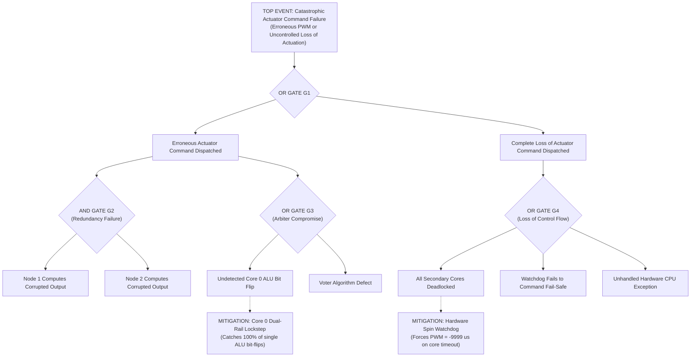

# Fault Tree Analysis (FTA)
## Top Event: Unmitigated Erroneous or Lost Actuator Command Dispatched to Flight Surfaces
### Reference: ARP4761 / NUREG-0492 / DO-178C DAL A

---

### 1. Qualitative Fault Tree Structure

---

### 2. Primary Initiating Events & Minimal Cut Sets

#### Cut Set 1: Multi-Channel Simultaneous Cosmic Ray Strike
- **Event**: Simultaneous bit flips in both Node 1 and Node 2 during the identical 5 µs consensus window with coincidentally agreeing corrupted values.
- **Probability**: On the order of $P(\text{SEU}_1) \times P(\text{SEU}_2) \approx 10^{-14}$ per flight hour.
- **Mitigation**: Evaluated as an acceptable residual risk under ECSS Class 1 space missions; total disagreement path in Tree 1 catches all non-coincident multi-node corruptions.

#### Cut Set 2: Common-Mode Toolchain Code Generation Defect
- **Event**: A defect in compiler instruction selection affects identical control algorithm paths on all three cores.
- **Probability**: Highly improbable for simple linear proportional arithmetic ($Kp = 0.3$).
- **Mitigation**: Mitigated via **Design Diversity Groundwork (P3.2)** wherein Node 2 executes a mathematically independent Q15 fixed-point algorithm (`flight_control_compute_diverse`).

#### Cut Set 3: Unhandled Master Arbiter Hardware Fault
- **Event**: Core 0 hardware fails without triggering an exception.
- **Mitigation**: Mitigated via external hardware watchdog and actuator-side timeout (`ACTUATOR_TIMEOUT_MS = 50 ms`) which independently drives the flight surface to aerodynamic neutral if pulses cease.

---

### 3. Conclusion & Safety Integrity Statement

The Fault Tree demonstrates that **no single initiating fault (Single Point Failure)** can propagate directly to the Top Event. Every single-point failure path is intercepted by an **AND gate** requiring two or more independent, concurrent failures, satisfying DO-178C DAL A fault tolerance criteria.
